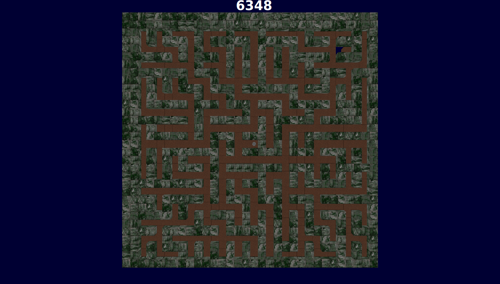

# PA11 - Labyrinth Hockey (Ben Nicholes, Denis Morozov, Saharath Kleips)
This project showcases a physics-based labyrinth game. 

## Notes
+ 2 ball play is default.
+ GStreamer is required for audio to work, see Installation Instructions.

## Extra Credit
+ Background Music
+ Main Menu
+ Random Maze Generation
+ Random texture generation
+ Multiple Levels
+ Game Restart
+ Win Screen

## Table of Contents
+ [Instructions](#instructions)
+ [Controls](#controls)
+ [Installation Instructions](install.md)  
+ [Build Instructions](build.md)  
+ [Bug Encounters / Error Fixes](bugs.md)

##Instructions
When the game starts you will be shown a title screen. That allows you to start a game or to exit. 
  
Once you start a game tilt the board to guide the marbles toward their goal.
  
Once you have reached your goal you will be shown a win message, then you can choose to restart the game or quit.

##Controls
Player Controls
<table>
    <tbody>
    <tr>
        <td>Right Arrow Key</td>
        <td>Tilt Board to the right.</td>
    </tr>
    <tr>
        <td>Left Arrow</td>
        <td>Tilt Board to the left.</td>
    </tr>
    <tr>
        <td>Up Arrow</td>
        <td>Tilt Board up.</td>
    </tr>
    <tr>
        <td>Down Arrow</td>
        <td>Tilt Board Down</td>
    </tr>
    </tbody>
</table>
Program Controls
<table>
    <tbody>
    <tr>
        <th>Action</th>
        <th>Description</th>
    </tr>
    <tr>
        <td>RMB + mouse movement</td>
        <td>Rotate camera</td>
    </tr>
    <tr>
        <td>Q</td>
        <td>Move camera down</td>
    </tr>
    <tr>
        <td>E</td>
        <td>Move camera up</td>
    </tr>
    <tr>
        <td>W</td>
        <td>Move camera forward</td>
    </tr>
    <tr>
        <td>A</td>
        <td>Move camera left</td>
    </tr>
    <tr>
        <td>S</td>
        <td>Move camera backwards</td>
    </tr>
    <tr>
        <td>D</td>
        <td>Move camera right</td>
    </tr>
    <tr>
        <td>Ctrl + P</td>
        <td>Pause Game</td>
    </tr>
    <tr>
        <td>Ctrl + R</td>
        <td>Restart Game</td>
    </tr>
    <tr>
        <td>Ctrl + Q</td>
        <td>Quit the Program</td>
    </tr>
    </tbody>
</table>
