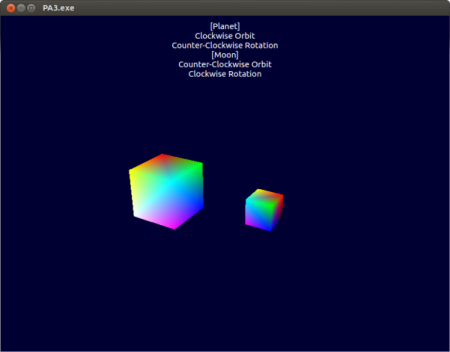

# PA3 - Moons (Saharath Kleips)
This program displays a planet orbiting around a central location with a moon that orbits the planet. Both the planet and the moon utilize the same mesh, but may act and transform independently of each other. In this program the moon will always orbit the planet no matter where the planet is, or what the planet is doing. Controls listed below showcase this interaction.



## Table of Contents
+ [Program Usage](#program-usage)  
    - [Controls](#controls)  
    - [Context Menu](#context-menu)  
+ [Installation Instructions](#installation-instructions)  
    - [Ubuntu 14.04 LTS](#ubuntu-14.04-lts)
+ [Build Instructions](#build-instructions)  

## Program Usage
###Controls
<table>
    <tbody>
        <tr>
            <th>Action</th>
            <th>Description</th>
        </tr>
        <tr>
            <td>Keyboard - Up</td>
            <td>Rotate planet counter-clockwise</td>
        </tr>
        <tr>
            <td>Keyboard - Down</td>
            <td>Rotate planet clockwise</td>
        </tr>
        <tr>
            <td>Keyboard - Left</td>
            <td>Orbit planet counter-clockwise</td>
        </tr>
        <tr>
            <td>Keyboard - Right</td>
            <td>Orbit planet clockwise</td>
        </tr>
        <tr>
            <td>Keyboard - W</td>
            <td>Rotate moon counter-clockwise</td>
        </tr>
        <tr>
            <td>Keyboard - S</td>
            <td>Rotate moon clockwise</td>
        </tr>
        <tr>
            <td>Keyboard - A</td>
            <td>Orbit moon counter-clockwise</td>
        </tr>
        <tr>
            <td>Keyboard - D</td>
            <td>Orbit moon clockwise</td>
        </tr>
        <tr>
            <td>Keyboard - ESC</td>
            <td>Exit the program</td>
        </tr>
        <tr>
            <td>Mouse - Left Click</td>
            <td>Reverse the orbits of both objects</td>
        </tr>
        <tr>
            <td>Mouse - Right Click</td>
            <td>Create a popup context menu</td>
        </tr>
    </tbody>
</table>

###Context Menu
<table>
    <tbody>
        <tr>
            <th>Context Item</th>
            <th>Description</th>
        </tr>
            <td>Unpause / Pause</td>
            <td>Unpauses / pauses all object montion</td>
        <tr>
        </tr>
        <tr>
            <td>Exit Program</td>
            <td>Exit the program</td>
        </tr>
    </tbody>
</table>

## Installation Instructions
### Ubuntu 14.04 LTS

**g++ Install**
```
sudo apt-get install build-essential
```

**OpenGL Install**
```
sudo apt-get install libgl1-mesa-dev
```

**Qt 5.5 Install**
64-bit
```
wget http://download.qt.io/official_releases/qt/5.5/5.5.0/qt-opensource-linux-x64-5.5.0-2.run

chmod +x qt-opensource-linux-x64-5.5.0-2.run

./qt-opensource-linux-x64-5.5.0-2.run
```
32-bit
```
wget http://download.qt.io/official_releases/qt/5.5/5.5.0/qt-opensource-linux-x86-5.5.0.run

chmod +x qt-opensource-linux-x86-5.5.0.run

./qt-opensource-linux-x86-5.5.0.run
```
Click "Next," then click "Skip," make a note of your installation directory then click "Next," make sure all of the components are selected then click "Next," agree to the license agreement and then click "Next," then click "Install," wait for the wizard to finish to uncheck "Launch Qt Creator," and then lastly click "Finish."

**Set Up Development Environment**


## Build Instructions
```
TODO: Write build instructions
```

## Bugs Encounters / Error Fixes
### "Not Found in Mesa Table OpenGL Error"
**Found on:**  
VirtualBox 5.0.2r102096
Host: Windows 7 Ultimate x64
Guest: Ubuntu 14.04 LTS x64 (Guest Additions Installed)
**Solution:**
Check `glxinfo`
```
glxinfo | grep OpenGL
```
glxinfo requires `mesa-utils` installed using
```
sudo apt-get install mesa-utils
```
The output should resemble the following and contain Chromium and not Mesa:
```
OpenGL vendor string: Humper
OpenGL renderer string: Chromium
OpenGL version string: 2.1 Chromium
OpenGL shading language version string: 4.50 NVIDIA
OpenGL extensions:
```
**Solution**
A fix is disabling 3D Hardware Acceleration on your VirtualBox.  
After disabling, your glxinfo should look similar to:
```
OpenGL vendor string: VMWare, Inc.
OpenGL renderer string: Gallium 0.4 on llvmpipe (LLVM 3.6 256 bits)
OpenGL version string: 3.0 Mesa 10.5.2
OpenGL shading language version string: 1.30
OpenGL context flags: (none)
OpenGL extensions:
```
Note the version string should now contain Mesa rather than Chromium.