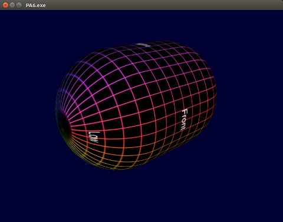

# PA6 - Assimp Texture Loading (Ben Nicholes, Denis Morozov, Saharath Kleips)
This sample program displays the usage of Assimp to load uv-coordinates for a model's textures. The image loader uses QImage which currently supports BMP, GIF, JPG, JPEG, PNG, PBM, PGM, PPM, XBM, and XPM. The model loaded must support uv-coordinates as well as be loaded with it's corresponding texture image.




## Table of Contents
+ [Program Usage](#program-usage)  
    - [Controls](#controls)
+ [Installation Instructions](#installation-instructions)  
    - [Ubuntu 14.04 LTS (RECOMMENDED)](#ubuntu-1404-lts)
    - [Ubuntu 12.04 LTS](#ubuntu-1204-lts)
    - [Other Linux Distrbutions](#other-linux-distributions)
    - [OSX](#osx)
    - [Windows](#windows)
+ [Build Instructions](#build-instructions)  
+ [Bug Encounters / Error Fixes](#bug-encounters--error-fixes)
    - [Not Found in Mesa Table OpenGL Error](#not-found-in-mesa-table-opengl-error)

## Program Usage
This program features custom model/texture loading from 2 file paths. Click [here](#build-instructions) for instructions on how to add the custom paths.

###Controls
<table>
    <tbody>
        <tr>
            <th>Action</th>
            <th>Description</th>
        </tr>
        <tr>
            <td>Keyboard - Up</td>
            <td>Zoom camera in</td>
        </tr>
        <tr>
            <td>Keyboard - Down</td>
            <td>Zoom camera out</td>
        </tr>
        <tr>
            <td>Keyboard - Left</td>
            <td>Rotate model negatively along the x-axis</td>
        </tr>
        <tr>
            <td>Keyboard - Right</td>
            <td>Rotate model postively along the x-axis</td>
        </tr>
        <tr>
            <td>Keyboard - Space</td>
            <td>Reset model rotation</td>
        </tr>
        <tr>
            <td>Keyboard - ESC</td>
            <td>Exit the program</td>
        </tr>
    </tbody>
</table>

## Installation Instructions
**It is recommended that you use Ubuntu 14.04 LTS.**
### Ubuntu 14.04 LTS
Tested with a clean install of Ubuntu 14.04 x64 LTS on VMWare Workstation Player with VMWare Tools installed and Windows 7 Ultimate x64 host.  

**g++ Install**
```
sudo apt-get install build-essential
```

**OpenGL Install**
```
sudo apt-get install libgl1-mesa-dev
```

**Qt 5.5 Install**  
Add the Qt5.5 PPAs by [Stephan Banner](https://launchpad.net/~beineri) and then install the latest Qt files.
```
sudo apt-add-repository ppa:beineri/opt-qt55-trusty
sudo apt-get update
sudo apt-get install qt-latest
```

**Set Up Development Environment**  
Your `qtchooser` should now list opt-qt55 as an option.
```
qtchooser --list-versions
```
Add the environment variables to your bashrc file.
```
echo 'export QT_SELECT=opt-qt55' >> ~/.bashrc
```
Restart your terminal.

**Assimp Install**
```
sudo apt-get install libassimp-dev
```

### Ubuntu 12.04 LTS
Tested with a clean install of Ubuntu 12.04 x64 LTS on VirtualBox 5.0.2r102096 with Guest Additions installed and Windows 8.1 x64 host.  

**g++ Install**
```
sudo apt-get install build-essential
```

**OpenGL Install**
```
sudo apt-get install libgl1-mesa-dev
```

**Qt 5.5 Install**  
Add the Qt5.5 PPAs by [Stephan Banner](https://launchpad.net/~beineri) and then install the latest Qt files.
```
sudo apt-add-repository ppa:beineri/opt-qt55
sudo apt-get update
sudo apt-get install qt-latest
```

**Set Up Development Environment**  
Add the environment variables to your bashrc file.
```
cd /opt/qt55/bin
./qt55-env.sh
```
Restart your terminal.

**WARNING: Potentially Unsupported**  
**Assimp Install**
```
sudo apt-get install libassimp-dev
```

### Other Linux Distributions 

Qt can be built from [source code](https://wiki.qt.io/Building_Qt_5_from_Git), and is most likely available in your distribution's repositories. However, an easy way of getting the latest Qt is using the official installer:

Download the [Qt Installer](http://www.qt.io/download-open-source/). Give it executable permissions and run as administrator.
```
chmod +x qt-unified-linux-x64-2.0.2-2-online.run
sudo ./qt-unified-linux-x64-2.0.2-2-online.run
```
Add the Qt binaries to PATH environment variable (assumes default install location of /opt/Qt/:
```
echo "PATH=\$PATH:/opt/Qt/Tools/QtCreator/bin:/opt/Qt/5.5/gcc_64/bin" >> ~/.bashrc
source ~/.bashrc
```

... and that's it!

### OSX

Install VirtualBox. Go get Ubuntu. Brew instructions unavailable.

### Windows

Really?

## Build Instructions
Navigate to the `build` directory.
```
qmake
make
```
Navigate to the `bin` directory.
```
Default model:
./PA6.exe

Custom model / texture:
Place the model & texture within the bin directory.
./PA6.exe MODEL_NAME TEXTURE_NAME
ex: ./PA6.exe table.obj table.png

Full-Path models / textures:
./PA6.exe /path/to/model.obj /path/to/texture.jpg
ex: ./PA6.exe /models/capsule.obj ../build/textures/capsule.jpg
```

Convenince Copy/Paste from the `build` directory:
```
qmake; make; cd ../bin; ./PA6.exe; cd ../build
make; cd ../bin; ./PA6.exe; cd ../build
```

**Note:** `qmake` does not need to be run before `make` everytime, only when the `.pro` file has been changed. Otherwise, simply `qmake` once and `make` from there on out.

## Bug Encounters / Error Fixes
### "Not Found in Mesa Table OpenGL Error"
**Found on:**  
VirtualBox 5.0.2r102096  
Host: Windows 7 Ultimate x64  
Guest: Ubuntu 14.04 LTS x64 (Guest Additions Installed)

VirtualBox 5.0.2r102096  
Host: Windows 8.1 x64  
Guest: Ubuntu 12.04 LTS x64 (Guest Additions Installed)  
**Error:**  
Check `glxinfo`:
```
glxinfo | grep OpenGL
```
glxinfo requires `mesa-utils` installed using:
```
sudo apt-get install mesa-utils
```
The output should resemble the following and contain Chromium and not Mesa:
```
OpenGL vendor string: Humper
OpenGL renderer string: Chromium
OpenGL version string: 2.1 Chromium
OpenGL shading language version string: 4.50 NVIDIA
OpenGL extensions:
```
**Solution:**  
A fix is disabling 3D Hardware Acceleration on your VirtualBox.  
After disabling, your glxinfo should look similar to:
```
OpenGL vendor string: VMWare, Inc.
OpenGL renderer string: Gallium 0.4 on llvmpipe (LLVM 3.6 256 bits)
OpenGL version string: 3.0 Mesa 10.5.2
OpenGL shading language version string: 1.30
OpenGL context flags: (none)
OpenGL extensions:
```
Note: The version string should now contain Mesa rather than Chromium.

**Alternative Solution**  
Download and install VMWare Workstation Player 12.  
Migrate your current virtual machine image and boot from VMWare.  
Install VMWare tools.  