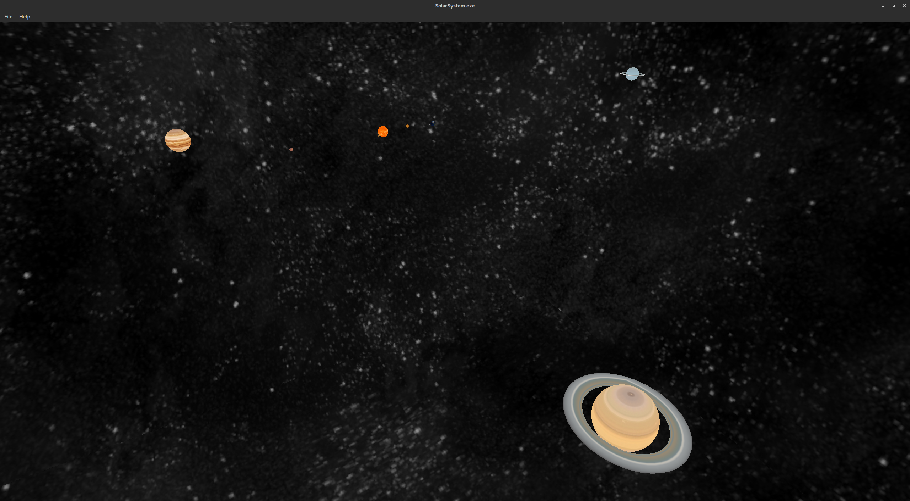

# PA7 - Solar System (Ben Nicholes, Denis Morozov, Saharath Kleips)
Interactable solar system created with Qt and OpenGL.

## Extra Credit:
+ Option to go from actual data to a scaled view
+ Uranus has its ring
+ Flythrough camera
+ Skybox
 

## Table of Contents
+ [Controls](#controls)
+ [Installation Instructions](install.md)  
+ [Build Instructions](build.md)  
+ [Bug Encounters / Error Fixes](bugs.md)

##Controls
<table>
    <tbody>
        <tr>
            <th>Action</th>
            <th>Description</th>
        </tr>
        <tr>
            <td>RMB + mouse movement</td>
            <td>Rotate camera</td>
        </tr>
        <tr>
            <td>RMB + Q</td>
            <td>Move camera down</td>
        </tr>
        <tr>
            <td>RMB + E</td>
            <td>Move camera up</td>
        </tr>
        <tr>
            <td>RMB + W</td>
            <td>Move camera forward</td>
        </tr>
        <tr>
            <td>RMB + A</td>
            <td>Move camera left</td>
        </tr>
        <tr>
            <td>RMB + S</td>
            <td>Move camera backwards</td>
        </tr>
        <tr>
            <td>RMB + D</td>
            <td>Move camera right</td>
        </tr>
        <tr>
            <td>Alt + F</td>
            <td>Open file menu</td>
        </tr>
        <tr>
            <td>Ctrl + P</td>
            <td>Start/pause Solar System</td>
        </tr>
        <tr>
            <td>Ctrl + R</td>
            <td>Switch between realistic and scaled view</td>
        </tr>
        <tr>
            <td>Ctrl + Q</td>
            <td>Quit application</td>
        </tr>
        <tr>
            <td>Alt + H</td>
            <td>Open help menu</td>
        </tr>
        <tr>
            <td>Ctrl + A</td>
            <td>About</td>
        </tr>
        <tr>
            <td>Ctrl + C</td>
            <td>Controls</td>
        </tr>
        <tr>
            <td>Ctrl + H</td>
            <td>More help</td>
        </tr>
        <tr>
            <td>Ctrl + T</td>
            <td>About Qt</td>
        </tr>
    </tbody>
</table>