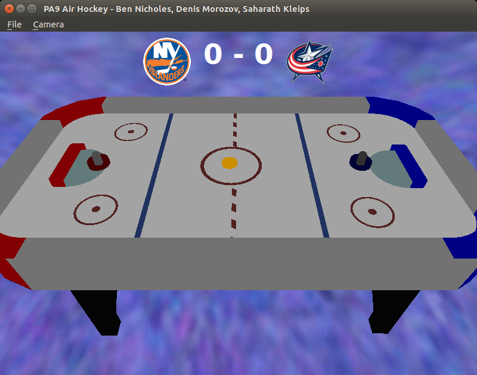
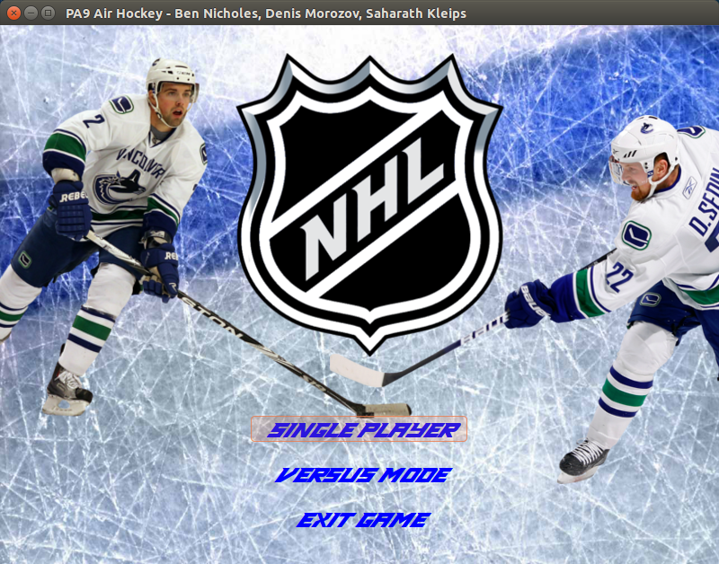
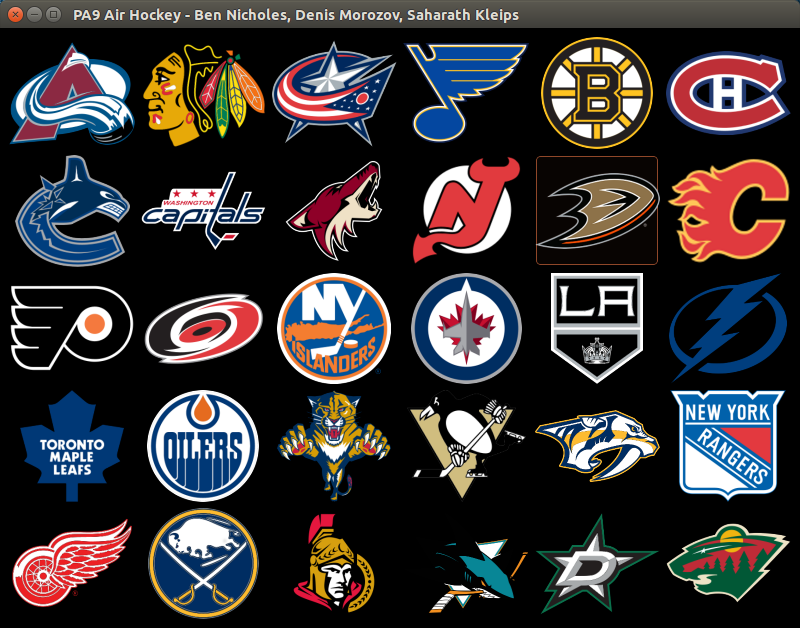
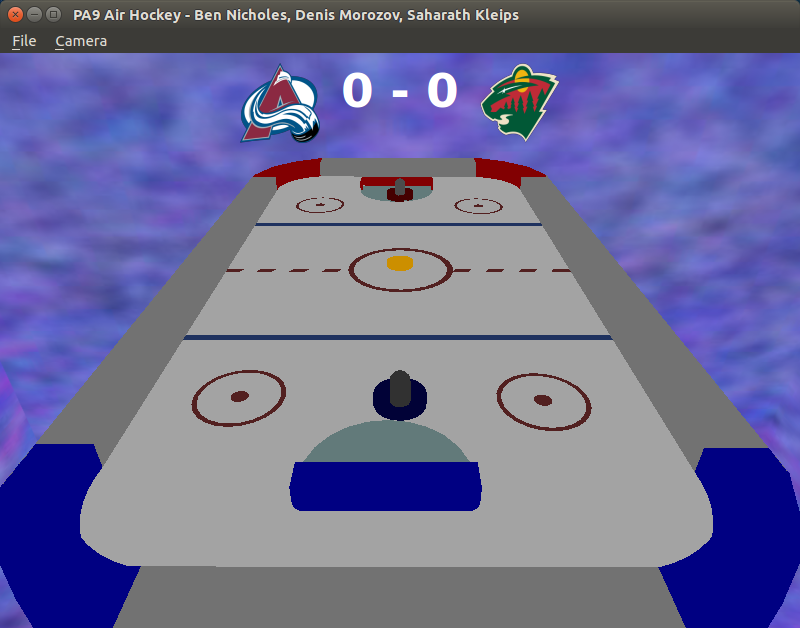

# PA9 - Air Hockey (Ben Nicholes, Denis Morozov, Saharath Kleips)
This project showcases a physics-based air hockey video game.  

## Notes
+ Single Player is disabled
+ GStreamer is required for audio to work, see Installation Instructions.

## Extra Credit
+ Sound for Hockey Table, Puck Collisions, and Goals
+ Main Menu
+ Team Select
+ 2 Players 

## Table of Contents
+ [Instructions](#instructions)
+ [Controls](#controls)
+ [Installation Instructions](install.md)  
+ [Build Instructions](build.md)  
+ [Bug Encounters / Error Fixes](bugs.md)

##Instructions
When first starting up the game you are presented with the game's title screen as shown below.  
  
Here you are allowed to select from Single Player (disabled) and Versus game modes, as well as the option to exit the game. Upon selecting either "Single Player" or "Versus Mode" you will be presented with the Team Select Screen as shown below.  
  
All 30 of your favorite NHL teams may be selected to play as and against! Clicking on a team's logo will select the first player's team, another click on a team's logo will select the second player's team. The game will then begin with the default Player 2 Perspective shown below.  
  
Here each player may control their respective paddles and attempt to hit the puck into the opposing player's goal. Upon scoring, the puck will reset and a new round will begin. There is no upper limit, so play to your heart's content!

##Controls
Player 1 Controls
<table>
    <tbody>
    <tr>
        <td>J Key</td>
        <td>Move Player Two Puck Left</td>
    </tr>
    <tr>
        <td>L Arrow</td>
        <td>Move Player Two Puck Right</td>
    </tr>
    <tr>
        <td>I Arrow</td>
        <td>Move Player Two Puck Up</td>
    </tr>
    <tr>
        <td>K Arrow</td>
        <td>Move Player Two Puck Down</td>
    </tr>
    </tbody>
</table>
Player 2 Controls
<table>
    <tbody>
    <tr>
        <td>Left Arrow</td>
        <td>Move Player One Puck Left</td>
    </tr>
    <tr>
        <td>Right Arrow</td>
        <td>Move Player One Puck Right</td>
    </tr>
    <tr>
        <td>Up Arrow</td>
        <td>Move Player One Puck Up</td>
    </tr>
    <tr>
        <td>Down Arrow</td>
        <td>Move Player One Puck Down</td>
    </tr>
    </tbody>
</table>
Program Controls
<table>
    <tbody>
    <tr>
        <th>Action</th>
        <th>Description</th>
    </tr>
    <tr>
        <td>RMB + mouse movement</td>
        <td>Rotate camera</td>
    </tr>
    <tr>
        <td>Q</td>
        <td>Move camera down</td>
    </tr>
    <tr>
        <td>E</td>
        <td>Move camera up</td>
    </tr>
    <tr>
        <td>W</td>
        <td>Move camera forward</td>
    </tr>
    <tr>
        <td>A</td>
        <td>Move camera left</td>
    </tr>
    <tr>
        <td>S</td>
        <td>Move camera backwards</td>
    </tr>
    <tr>
        <td>D</td>
        <td>Move camera right</td>
    </tr>
    <tr>
        <td>Ctrl + P</td>
        <td>Pause Game</td>
    </tr>
    <tr>
        <td>Ctrl + R</td>
        <td>Restart Game</td>
    </tr>
    <tr>
        <td>Ctrl + Q</td>
        <td>Quit the Program</td>
    </tr>
    <tr>
        <td>Ctrl + F1</td>
        <td>Switch Camera to Player 1 Perspective</td>
    </tr>
    <tr>
        <td>Ctrl + F2</td>
        <td>Switch Camera to Player 2 Perspective</td>
    </tr>
    <tr>
        <td>Ctrl + F3</td>
        <td>Switch Camera to Side of the Table</td>
    </tr>
    <tr>
        <td>Ctrl + F4</td>
        <td>Switch Camera to Top of Table Perspective</td>
    </tr>
    </tbody>
</table>